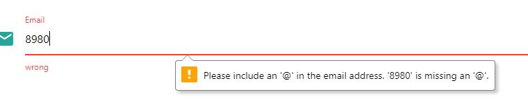
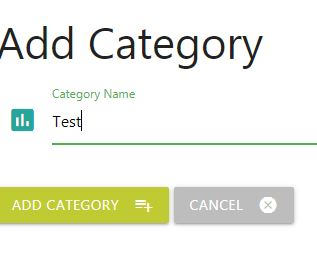
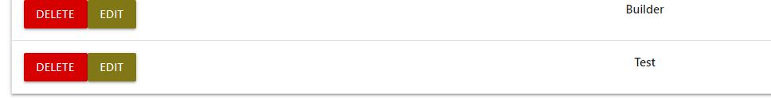
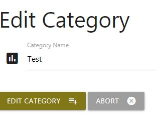

#######################################################

<h3>>Version Control</h3>

Available in VERSION.md file 

<h3>Project Info</h3>

Complain It is a fully functional web apllication that allows user to add information about recent job done by a trademan in order to approve or complain it so other user can take advantage of their experience and may decide whetever to do with their house project.

Complain a local tradesman if the job he/she did is not good enough, so other people can rely on your experience and they can avoid unnecessary hustle.

We are a non-profit organisation that helps people with selecting proper tradesman for a certain job. It allows user to see other job whenever they are good or bad. Our application will always be for FREE.

<h3>UX</h3>

Page is divided into 6 anchor points that are available from navigation menu located at the top of the page. Also there is 3 anchor point that are located in the footer sections

TOP:

Home -- Homepage it show the general information about project

How it works -- Show how the proposed project works

Search for complained job -- Ability to check the database for posts that were uploaded to the website.

Complain a job -- Ability to publish some information about job.

Categories -- fully functional menu that allows to add/modify or delete existing categories.

FAQ - Frequently Asked Questions

FOOTER:

Privacy Policy -- Information how your data is used by our company

Contact Us -- Ability to send an email to our office using emailJS component

Directions -- How to approach our office using Google Maps API

As a homeowner, I want to look for a jobs done by tradesman in order to proceed with mine.

As a contractor, I want to search for bad jobs in order to look for a good tradesman.

As a DIY guy, I want to look for inspirations using the application provided.

As a housewife, I often looking for refurbishments and the application can show me which tradesman NOT to hire.

As a man, I often would like to see other handyman job, especially if they were executed badly.

As a enterpreneur I would like my handymans deliver good job, so their job would not be presented on that website.

<h3>Testing</h3>
Website was tested using 3 devices: Desktop PC, Tablet (Samsung a300) and smartphone (Samsung s8+ EDGE). Website was also tested using Inspect function in Google Chrome
HTML and CSS Validator were also used in place.

<h3>Testing write-up</h3>

1) Contact form tests (email validation)

When you try to enter invalid email (one without @sign) it would present you the error.
 

2) Too add new category just go Categories fromt top menu and click enter "Add new category" the form should appear. For purpose in the test we add "TEST" category.
 

As a result we have a new category called test
 

 
3) To remove a category just click 'DELETE' button next to category name. 

After clicking the category is no longer visible as on attached Screenshots 

4)To edit category click on EDIT button next to category name. For purpose of this test we will change the name from Test to TESTNUMBER2
  
  

5)Both forms will no longer be available to send/publish without all fields presented. If you skip one or another field the system would give you an error message before submitting 
  
<h3>Deployement</h3>
Using Git Command Line to upload to a repository

Type in terminal these commands: 
<code>git init</code> to initialize a new repository 
<code>git add README.md</code> to add README.md file to repository 
<code>git commit -m "Initial commit"</code> to add a message for first commitement .
<code>git remote add origin https://github.com/bloobsky/your_repository_name.git</code> to assign repository 
<code>git push -u origin master</code> to upload files to the repository 
 

For heroku development type in terminal these commands 

<code>heroku login</code> "then entry your login and password" 
<code>pip3 freeze --local > requirements.txt </code>"these is essential for heroku to word" 
<code>echo web: python app.py > Procfile</code>create a Procfile with "web: python app.py" 
<code>heroku git:clone -a [repository_name]</code> 
<code>git push heroku master</code> 
 
Your website is available now @ https://repository_name.herokuapp.com 

<h3>Project is deployed @ GitHub and Heroku</h3>
Github was used in deployement process as it is integrated, simple and ther is no need to use additional services.
It also containt Version Control and everything is uploaded using terminal commands (git)

<h3>How it is done ?</h3>

Open www.github.com.
Login with your credentials
On the Navigation Bar in the repository you would like to deploy look for 'settings' link.
Scroll down the page and look for 'GitHub Pages'
Under the source section select 'master branch' option
Message should appear 'Your site is ready to be published at https://$YourLogin.github.io/$RepositoryName/
Your website is deployed now.

<h3>Technologies,Programming Languages and APIs</h3>

HTML5, CSS, Materialize, JavaScript, jQuery, Python, Flask with (PyMongo, dnspython), MongoDB, GoogleFonts
API: emailJS and Google Maps API

<h3>Features to be implemented</h3>

Ability to edit previously  posted jobs. At the moment we have only 'DELETE' option. 
Login / Signup possibilities in order to expand a 'project' for fully functional website that would help people at some stage 

<h3>Media</h3>

Screenshots for testing were done by using SnippingTool @ MS Windows
ComplainIt logo was created in Adobe Illustrator.
Icons used in Project are part of Materialize (www.materialize.com)

<h3>Acknowledgements</h3>

I received inspiration from CodeInstitute (www.codeinstitute.net)
Privacy Policy was generated using www.iubenda.com
MongoDB Atlas - for possibility to create a free database
Gitpod was used to entirely written all the code for the proposed project.